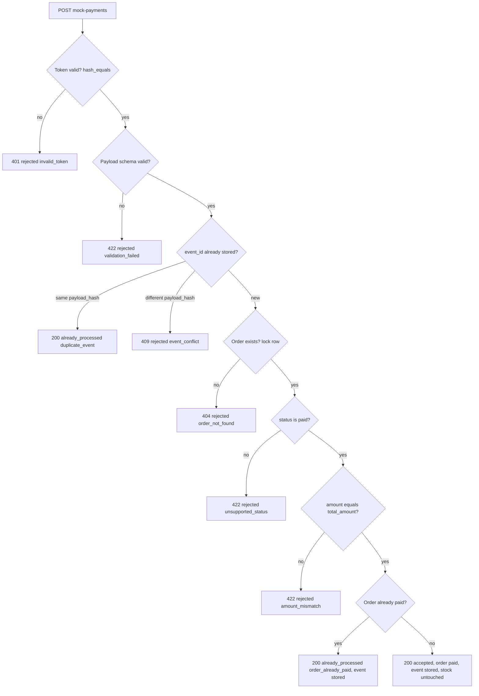

# AI_AGENT.md — Engineering Contract

This file is the binding contract for all work on the Mini Gold Checkout project, including this agent's own future turns. Every implementation decision in Phase 4 must follow this document. If a change requires deviating from it, the deviation is discussed and this file is updated first — code does not silently drift from the contract.

Scope reference: [BRIEF.md](BRIEF.md). Visual reference: [DESIGN.md](DESIGN.md).

---

## 1. Tech stack decision

- **Framework:** Laravel 13 (`^13.0`, requires PHP 8.3–8.5), installed from the plain `laravel/laravel` skeleton — no Breeze/Jetstream starter kit.
- **Views:** Blade + Tailwind v4 (the skeleton's default Vite/Tailwind setup) + Alpine.js, scoped strictly to the button submitting state, the quantity stepper, and dismissible flash messages. No business logic in Alpine.
- **Database:** SQLite as the default/primary driver (zero-setup for a reviewer: `touch database/database.sqlite && php artisan migrate --seed`). MySQL is an opt-in second target used specifically to prove real row-locking under concurrency (see §4).
- **API routing:** `routes/api.php` registered by hand in `bootstrap/app.php`; the `install:api` Sanctum scaffold is not used since there's no login in scope.

**Justification (3-hour constraint):** Livewire and a full SPA both add a lifecycle (component hydration, wire:model debouncing, or a separate frontend build/test toolchain) that has to be learned or debugged on the clock without adding grading value — the brief's assessed behavior (stock accuracy, price integrity, idempotent webhook, failure handling) is entirely server-side and provable with plain HTTP requests. Plain Blade forms plus a thin Alpine layer keep every graded interaction as a standard POST/redirect or JSON request, which is the fastest thing to build correctly and the easiest thing to write a Feature test against — the same test technique (`$this->post(...)`) covers both the checkout form and the webhook with no browser or component-testing layer needed. SQLite as the default keeps setup to two commands so time isn't spent on database provisioning; MySQL is kept available specifically because SQLite cannot prove the one concurrency requirement that matters most for this brief (§4).

---

## 2. Architecture

### 2.1 Layers

- **Controllers are thin.** They validate via a Form Request, call exactly one service method, and translate the result into a redirect (web) or JSON response (API). No Eloquent queries, no arithmetic, no transaction handling in a controller.
- **Business logic lives in Services:**
  - `App\Services\OrderService::placeOrder(int $productId, int $quantity): Order` — owns the locked stock check, price snapshotting, and order creation.
  - `App\Services\PaymentService::handle(array $payload): PaymentResult` — owns token-independent business validation, idempotency checks, and the pending→paid transition.
- **Domain exceptions**, not generic ones, signal expected failure modes: `App\Exceptions\Domain\InsufficientStockException`, `ProductNotFoundException`, `EventConflictException`, etc. Controllers catch these and map them to the response shape in §3.3 — they never leak a raw `QueryException` or `ValidationException` trace to the client.
- **Enums** replace magic strings: `App\Enums\OrderStatus` (`Pending`, `Paid`), `App\Enums\PaymentResult` (`Accepted`, `AlreadyProcessed`, `Rejected`).
- **Views render only what they're given.** All money passes through one formatter — a `Money::rupiah(int $amount): string` helper backing an `<x-money :amount="$order->total_amount" />` Blade component — so the `Rp1.500.000` formatting rule in `DESIGN.md` is implemented in exactly one place. Views run no queries and perform no arithmetic (e.g. `quantity * unit_price` is never computed in a Blade file).

### 2.2 Data model

**`products`**
| Column | Type | Notes |
|---|---|---|
| `id` | bigint PK | |
| `name` | string | |
| `price` | unsigned bigint | Integer rupiah |
| `stock` | unsigned int | |
| timestamps | | |

**`orders`**
| Column | Type | Notes |
|---|---|---|
| `id` | bigint PK | |
| `order_number` | string, unique index | e.g. `ORD-20260925-7K2QXM` |
| `product_id` | FK → products | |
| `product_name` | string | Snapshot at checkout time |
| `quantity` | unsigned int | |
| `unit_price` | unsigned bigint | **Price at checkout** — the source of truth for this order, regardless of later product price changes |
| `total_amount` | unsigned bigint | `unit_price * quantity`, computed server-side once |
| `status` | string/enum | `pending` \| `paid` |
| `paid_at` | nullable timestamp | |
| timestamps | | |

**Immutable once written:** `order_number`, `product_id`, `product_name`, `quantity`, `unit_price`, `total_amount`. Enforced in code, not just by convention: an `updating` model event on `Order` throws an exception if any of these attributes are dirty. The only mutation ever permitted after creation is `status: pending → paid` (plus `paid_at`).

**`payment_events`**
| Column | Type | Notes |
|---|---|---|
| `id` | bigint PK | |
| `event_id` | string, **unique index** | From the webhook payload |
| `order_id` | FK → orders | |
| `order_number` | string | Denormalized copy from the payload, for audit/debugging |
| `amount` | unsigned bigint | As received |
| `status` | string | As received |
| `payload_hash` | string (sha256) | Hash of `event_id|order_number|amount|status`, used to detect a reused `event_id` with different data |
| `result` | string/enum | `accepted` \| `already_paid` |
| timestamps | | |

Only requests that pass token + validation are persisted as a `payment_events` row — a request rejected for a bad token or malformed payload never claims an `event_id`, so a legitimate retry with a fixed payload is still accepted.

### 2.3 Concurrency strategy (non-negotiable)

**Any code path that reads or writes `products.stock` must use this exact pattern:**

1. Open `DB::transaction(function () { ... })`.
2. Lock the row: `Product::whereKey($id)->lockForUpdate()->first()`.
3. Check `stock >= $quantity` against the locked row; throw `InsufficientStockException` if not, which rolls back the transaction with zero side effects.
4. Decrement with a guard clause, not a bare save: `Product::whereKey($id)->where('stock', '>=', $quantity)->decrement('stock', $quantity)` and assert exactly 1 row was affected.
5. Create the `Order` row inside the same transaction, using the price read from the same locked `Product` row.
6. Any exception anywhere in the block rolls back both the stock decrement and the order insert — there is no code path that leaves a stock reduction without a matching order, or an order without a matching stock reduction.

This is stated as non-negotiable because it is the mechanism that satisfies the brief's core requirement ("protect the last unit of stock from two simultaneous checkouts") and the "no partial failures" requirement simultaneously. `lockForUpdate()` provides real row-level blocking on MySQL/PostgreSQL. On SQLite, `lockForUpdate()` is a no-op, so step 4's guarded, single-statement decrement (`WHERE stock >= quantity`) is what actually prevents negative stock there — SQLite's whole-database write lock serializes the transactions, and the guard clause makes the outcome correct even without row-level locking. Both database drivers are therefore protected by the same code path, not by driver-specific branches.

### 2.4 Idempotency strategy for `POST /api/mock-payments`



- `event_id` is enforced unique at the database level (`payment_events.event_id` unique index), not just in application code — the constraint is the real guard against a race between two identical requests arriving at the same moment.
- **Reused `event_id`, same payload:** the incoming payload's hash matches the stored `payload_hash` → treated as the same event, responded to with `already_processed`, no state change, no new row.
- **Reused `event_id`, different payload:** the hash differs → rejected with `409 event_conflict`. This is never silently accepted or silently ignored, since accepting it would mean two different claims share one `event_id`.
- **New `event_id`, order already `paid`:** the order lookup (also under `lockForUpdate`) shows `status = paid` → responded to with `already_processed` / `order_already_paid`, and the event is still stored (it's a valid, distinct event, it just has no further effect) — the order's `paid_at` and stock are untouched.
- **Race between two different new events for the same order:** the order row is locked with `lockForUpdate` inside the same transaction that reads and updates it, so two concurrent webhook calls for one order are serialized; the second one sees the already-updated status and returns `already_processed`.
- Stock is never touched by `PaymentService` — payment confirmation only ever transitions `status` and sets `paid_at`. The stock decrement happened once, at checkout, per §2.3.
- **Token check:** read from `config('services.mock_payment.token')`, sourced from the `MOCK_PAYMENT_TOKEN` environment variable, compared with `hash_equals()` (not `===`) in a `VerifyMockPaymentToken` middleware. The check **fails closed**: if the configured token is empty/unset, every request is rejected — an empty header is never treated as matching an empty config value.

---

## 3. Coding standards

### 3.1 Naming conventions

- **Models:** singular StudlyCase — `Product`, `Order`, `PaymentEvent`.
- **Services:** `*Service` suffix — `OrderService`, `PaymentService`.
- **Form Requests:** `*Request` suffix — `StoreOrderRequest`, `MockPaymentRequest`.
- **Routes:** `products.index`, `orders.store`, `orders.show` (route-model-bound by `order_number`, not `id`), `api.mock-payments.store`.
- **DB columns:** snake_case; every money column is named `*_price` or `*_amount` and is always an integer type — never `float`/`decimal`, to avoid floating-point rounding on currency.

### 3.2 Validation rules

- `product_id`: `required|integer|exists:products,id`.
- `quantity`: `required|integer|min:1`.
- **The stock-sufficiency check is never performed in the Form Request** — only inside the locked transaction in `OrderService` (§2.3). Checking it earlier would read an unlocked value and reintroduce the exact race the transaction exists to prevent.
- **Price and total are never read from the request.** Form Requests expose only `validated()`, and controllers/services never call `$request->all()` or `$request->input('price'|'total')`. If the incoming payload includes `price` or `total` fields (checkout or webhook), they are ignored outright — they don't appear in the validated array at all, so there's no code path where they could accidentally reach a query or a model attribute.

### 3.3 Error handling convention

**Web (checkout form):**
- A rejected checkout redirects back (`302`) with the validation/domain error in the error bag and old input preserved.
- A domain failure (e.g. insufficient stock) surfaces as a flash message per `DESIGN.md` §6 ("Only 1 unit of Antam 1 gram is available").
- A request for a nonexistent order number returns `404`.

**API (`/api/mock-payments`)** — every response, success or failure, uses one consistent envelope:

```json
{
  "result": "accepted|already_processed|rejected",
  "code": "ok|invalid_token|validation_failed|event_conflict|order_not_found|unsupported_status|amount_mismatch|order_already_paid",
  "message": "human-readable explanation",
  "order_number": "ORD-...",
  "order_status": "pending|paid"
}
```
- `errors` (Laravel's standard validation error map) is added only when `code = validation_failed`.
- HTTP status codes follow the flowchart in §2.4: `401` invalid token, `422` validation/unsupported-status/amount-mismatch, `409` event conflict, `404` unknown order, `200` for both `accepted` and `already_processed`.

**All-or-nothing rule:** every state-changing operation (checkout, payment confirmation) executes inside exactly one `DB::transaction()`. No operation writes some rows, hits an error, and leaves the rest committed — either the whole unit of work commits, or nothing does. This applies identically to the "no partial failures" checkout requirement and the "invalid requests must not change order status" webhook requirement — they're the same rule applied twice.

### 3.4 Currency handling

- All monetary values are stored and passed around the codebase as **integer rupiah** (no cents/subunits, no floats, no `decimal` columns).
- `total_amount = unit_price * quantity`, computed once server-side in integer arithmetic and persisted — never recomputed from stale inputs, never accepted from the client.
- Display formatting (`Rp1.500.000`, dot thousands separators) happens in exactly one place, per §2.1 and `DESIGN.md` §4 — application/business code never manipulates a formatted string.

---

## 4. Testing standards

Default test run: SQLite in-memory (`RefreshDatabase`), matching the app's default driver.

### 4.1 Required scenario mapping

| # | Brief requirement | Test |
|---|---|---|
| 1 | Valid checkout creates an order and reduces stock | `tests/Feature/CheckoutTest::test_valid_checkout_creates_pending_order_and_reduces_stock` |
| 2 | Insufficient stock is rejected without any data change | `tests/Feature/CheckoutTest::test_insufficient_stock_is_rejected_without_data_change` — asserts order count and product stock are byte-identical before/after |
| 3 | Request price manipulation has no effect | `tests/Feature/CheckoutTest::test_request_price_and_total_are_ignored` — posts a forged `price`/`total` and asserts the persisted order uses the real product price |
| 4 | A repeated payment event does not add any additional effect | `tests/Feature/MockPaymentTest::test_repeated_event_has_no_additional_effect` — asserts `status`, `paid_at`, `payment_events` row count, and product stock are unchanged after the same event is replayed |
| 5 | An incorrect token and an incorrect amount each do not change the status | `tests/Feature/MockPaymentTest::test_invalid_or_missing_token_does_not_change_status` and `tests/Feature/MockPaymentTest::test_incorrect_amount_does_not_change_status` |

### 4.2 Additional tests (time-permitting, not required minimums)

- Unknown `product_id`; quantity of `0`, negative, or non-integer.
- Checkout against a zero-stock product (`Emasku 0.5 gram`).
- Product price changed after checkout does not alter the existing order's `unit_price`/`total_amount`.
- Reused `event_id` with a different payload → `409 event_conflict`.
- New `event_id` targeting an already-`paid` order → `already_processed`, stock untouched.
- A `status` other than `paid` in the webhook payload is rejected.

### 4.3 Concurrency testing strategy

- `tests/Feature/ConcurrentCheckoutTest`, tagged `#[Group('concurrency')]`, is **skipped automatically** unless `DB_CONNECTION` is `mysql` or `pgsql`.
- Uses `DatabaseTruncation` instead of `RefreshDatabase`, since child processes need to see committed rows over separate connections.
- Forks multiple child processes with `pcntl_fork()`; each child calls `DB::purge()` to get its own connection, and all children race to buy the single unit of `Antam 1 gram` (seeded stock = 1) concurrently.
- Assertion: exactly 1 order is created, final stock is `0`, and stock is never observed negative at any point.
- Run explicitly against MySQL: `DB_CONNECTION=mysql DB_DATABASE=gold_checkout_test php artisan test --group=concurrency`.

**SQLite limitation (stated explicitly, per brief §06):** SQLite serializes writers with a whole-database lock and does not implement row-level `SELECT ... FOR UPDATE` semantics — `lockForUpdate()` is accepted but has no locking effect. The default SQLite-backed suite therefore proves the checkout logic is *correct in sequence* (right stock math, right order fields), but it cannot prove the *race* is handled, because SQLite never actually lets two transactions interleave on the same row. Verification against a production-grade database is done two ways: (1) the `pcntl_fork`-based `ConcurrentCheckoutTest` above run against MySQL, and (2) a manual two-terminal check documented in the README — open two `psql`/`mysql` sessions, start a transaction in one, attempt a concurrent checkout in the other, and observe it block until the first commits or rolls back.

---

## 5. AI usage discipline

- **Verify before accepting.** Every non-trivial AI-generated change (anything beyond a one-line fix or a rename) is accepted only after the relevant test file is run with `php artisan test` and shown passing. A change is never marked done on the basis of "it looks correct."
- **Flag decisions as they happen, don't defer them.** While working, every notable AI suggestion — accepted, modified, or rejected — is flagged inline in the response and as a one-line note in the commit body, using this fixed shape so they can be mechanically compiled later:

  ```
  AI-DECISION [accepted|modified|rejected]: <what was suggested> | <why> | <how it was verified>
  ```

  `AI_USAGE.md` is **not written yet**. These flagged lines are the raw material for it and will be compiled into that file only once Phase 4 is complete, per the brief's §07 requirements (tool/model used, three important prompts + decisions, examples of changed/rejected suggestions or verification of accepted ones, and how output was verified).
- **First flagged decision (carried over from planning):**
  `AI-DECISION [accepted]: Use pcntl_fork() for the MySQL concurrency test instead of Laravel's Concurrency facade | pcntl_fork gives true separate DB connections/processes needed to reproduce a real row-lock race, which the Concurrency facade's driver model doesn't guarantee | to be verified once ConcurrentCheckoutTest is written and run against MySQL in Phase 4`
- **Time tracking.** Start and finish timestamps for the work session are recorded in the README, not here, per the brief's §02 requirement.

---

## Stop point

This file is the complete Phase 3 deliverable. No application code, migration, or scaffold is created until this file is approved. Phase 4 begins with `laravel new` into a temp directory (this directory is non-empty) followed by the migrations/seeders/services/tests described above, in that order.
